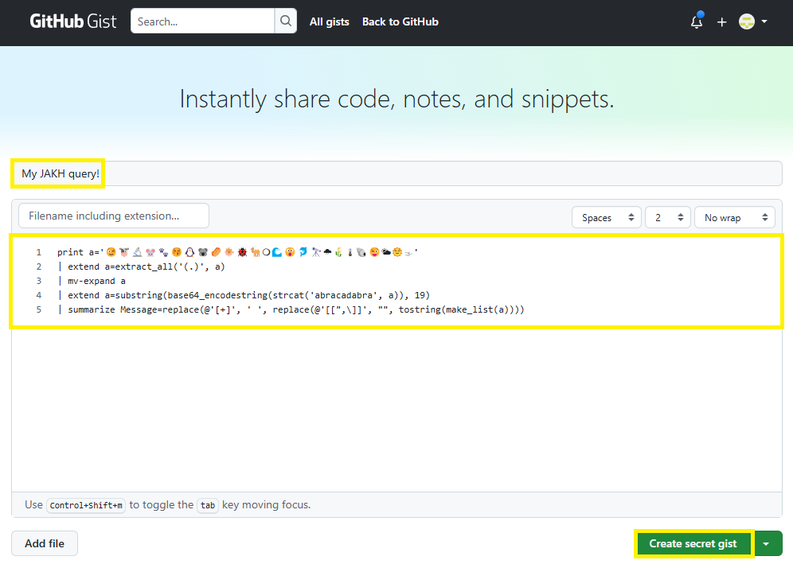
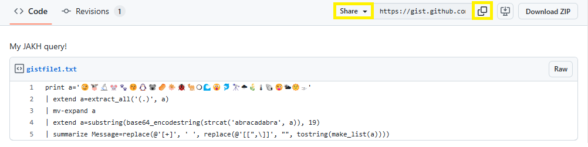
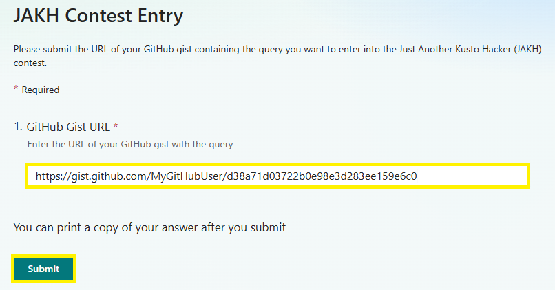

# MICROSOFT JUST ANOTHER KUSTO HACKER ("JAKH") CONTEST OFFICIAL RULES

## 1. SPONSOR

These Official Rules ("Rules") govern the operation of the Microsoft Just another Kusto Hacker ("JAKH") Contest ("Contest"). Microsoft Corporation, One Microsoft Way, Redmond, WA, 98052, USA, is the Contest sponsor ("Sponsor"). 

## 2. DEFINITIONS

In these Rules, "Microsoft", "we", "our", and "us" refer to Sponsor and "you" and "yourself" refers to a Contest participant, or the parent/legal guardian of any Contest entrant who has not reached the age of majority to contractually obligate themselves in their legal place of residence. By entering you (your parent/legal guardian if you are not the age of majority in your legal place of residence) agree to be bound by these Rules.  

## 3. ENTRY PERIOD

The Contest starts at **12:00 p.m. Pacific Time (PT) on April 1, 2025**, and ends at **11:59 p.m. PT on April 30, 2025** and consists of the following rounds: 

- *Round 1 - Submission ("Entry Period")*: April 1, 2025 12:00 p.m. PT – April 30, 2025, 11:59 p.m. PT

- *Round 2 - Public Voting ("Public Voting Period")*: April 1, 2025, 12:00 p.m. PT – April 8, 2025, 12:00 p.m. PT

To be eligible for the Public Voting Round, all valid entries must be received during the Entry Period.

## 4. ELIGIBILITY

To enter, you must 18 years of age or older and have a [GitHub account](https://docs.github.com/en/get-started/start-your-journey/creating-an-account-on-github). If you are 18 years of age or older but have not reached the age of majority in your legal place of residence, then you must have consent of a parent/legal guardian. 

Void in Cuba, Iran, North Korea, Sudan, Syria, Region of Crimea, Russia, and where prohibited.

## 5. HOW TO ENTER

1. To create an entry, Create a [GitHub Gist](https://gist.github.com/).
    - The Gist should contain a Kusto query that outputs the string `"Just another Kusto hacker"`. The query can be as simple or as complex as you like, but it must output this string.
    - The query should not depend on any specific data source, and should be self-contained and runnable on any Fabric EventHouse or Azure Data Explorer cluster.
        - For developing and testing your query, you can use [a free Azure Data Explorer cluster](https://learn.microsoft.com/en-us/azure/data-explorer/start-for-free-web-ui) or the [Azure Data Explorer Emulator](https://learn.microsoft.com/en-us/azure/data-explorer/kusto-emulator-install).
        - Examples for queries can be found [here](./resources/sample-queries)
    - The query should be written only using the Kusto query language, without use of plugins that allow execution of code in other languages (e.g., Python).
    - The Gist can be either *secret* or *public* (note that secret gists aren't private, and are accessible by anyone with the URL).
    - The Gist can be modified up until the end of the contest's Entry Period. Only the last version of the Gist will be considered for the contest.

2. To submit an entry, fill in the URL for your gist in [this form](https://aka.ms/submit-jakh-query), and submit.
    - The URL should be the original URL of the Gist which includes your GitHub username, and not a shortened URL or a URL that redirects to the Gist.

The entry limit is up to 3 entries per person.

Any attempt by you to obtain more than the stated number of entries by using multiple/different accounts, email addresses, identities, registrations, logins, or any other methods will void your entries and you may be disqualified. Use of any automated system to participate is prohibited.  

We are not responsible for excess, lost, late, or incomplete entries. If disputed, entries will be deemed submitted by the "authorized account holder" of the email address, social media account, or other method used to enter. The "authorized account holder" is the natural person assigned to an email address by an internet or online service provider, or other organization responsible for assigning email addresses. 

### Creating a Gist

1. [*optional*] Enter a description for your Gist.
2. Enter the Kusto query that outputs the string "Just another Kusto hacker".

    

### Getting the Gist URL

1. Choose "Share" from the Gist menu.
2. Copy the URL from the dialog.

    

### Submitting the Gist

1. Paste the URL into the form.
2. Click "Submit".

    

## 6. ELIGIBLE ENTRY

To be eligible, an entry must meet the following content/technical requirements: 

- Your entry must be your own original work; and
- Your entry cannot have been selected as a winner in any other contest; and
- You must have obtained all consents, approvals, or licenses required for you to submit your entry; and
- To the extent that entry requires the submission of user-generated content such as software, photos, videos, music, artwork, essays, etc., entrants warrant that their entry is their original work, has not been copied from others without permission or apparent rights, and does not violate the privacy, intellectual property rights, or other rights of any other person or entity. You may include Microsoft trademarks, logos, and designs, for which Microsoft grants you a limited license to use for the sole purposes of submitting an entry into this Contest; and
- Your entry may NOT contain, as determined by us in our sole and absolute discretion, any content that is obscene or offensive, violent, defamatory, disparaging, or illegal, or that promotes alcohol, illegal drugs, tobacco or a particular political agenda, or that communicates messages that may reflect negatively on the goodwill of Microsoft. 

## 7. USE OF YOUR ENTRY

We are not claiming ownership rights to your Submission. However, by submitting an entry, you grant us a perpetual,n irrevocable, royalty-free, non-exclusive, worldwide right and license to use, review, assess, test and otherwise analyze your entry and all its content in connection with this Contest and to use your entry in any media whatsoever now known or later invented for any non-commercial or commercial purpose, including, but not limited to, the marketing, sale or promotion of Microsoft products or services, without further permission from you. Additionally, you grant us the right to reproduce, prepare derivative works of, publicly display, publicly perform, and distribute the Submission and such derivative works, and to sublicense an or all of the foregoing rights to third parties. You will not receive any compensation or credit for use of your entry, other than what is described in these Official Rules.

By entering you acknowledge that we may have developed or commissioned materials similar or identical to your entry and you waive any claims resulting from any similarities to your entry. Further you understand that we will not restrict work assignments of representatives who have had access to your entry, and you agree that use of information in our representatives' unaided memories in the development or deployment of our products or services does not create liability for us under this agreement or copyright or trade secret law.

Your entry may be posted on a public website. We are not responsible for any unauthorized use of your entry by visitors to this website. We are not obligated to use your entry for any purpose, even if it has been selected as a winning entry.

## 8. WINNER SELECTION AND NOTIFICATION

Winners will be determined in multiple phases as follows:

- *Phase 1 - Judging*: Pending confirmation of eligibility, a panel of qualified judges will select the finalist categories and entries based on the following judging criteria:

    - 25% - Adherence to the contest theme (output of user-provided query should be "Just another Kusto hacker")
    - 25% - Originality
    - 50% - Sophistication of user-provided query

- *Phase 2 - Public Voting*: During this phase, the finalist entries will be posted to an invite-only private GitHub repository for voting. Participants will be invited to vote for their favorite entry. At the close of the Public Voting Phase, the entry with the most votes per category will be considered potential winners. Each individual may vote one (1) time overall. 

In the event of a tie between any eligible entries or an insufficient number of votes, a panel of qualified judges will break the tie based on the judging criteria described above. The decisions of the judges are final and binding.

It is prohibited for any person to obtain votes by any fraudulent or inappropriate means, including offering prizes or other inducements in exchange for votes, automated programs or fraudulent i.d's. Microsoft will void any questionable votes.

Winners will be notified via their GitHub accounts provided during entry no more than 7 days following judging.

## 9. PRIZES

There are no prizes for this competition, just recognition of your hard work!

## 10. ODDS

The odds of winning are based on the quality and number of eligible entries received.

## 11. GENERAL CONDITIONS AND RELEASE OF LIABILITY

To the extent allowed by law, by entering you agree to release and hold harmless Microsoft and its respective parents, partners, subsidiaries, affiliates, employees, and agents from any and all liability or any injury, loss, or damage of any kind arising in connection with this Contest.

All local laws apply. The decisions of Microsoft are final and binding.

We reserve the right to cancel, change, or suspend this Contest for any reason, including cheating, technology failure, catastrophe, war, or any other unforeseen or unexpected event that affects the integrity of this Contest, whether human or mechanical. If the integrity of the Contest cannot be restored, we may select winners from among all eligible entries received before we had to cancel, change or suspend the Contest. 

If you attempt or we have strong reason to believe that you have compromised the integrity or the legitimate operation of this Contest by cheating, hacking, creating a bot or other automated program, or by committing fraud in any way, we may seek damages from you to the full extent of the law and you may be banned from participation in future Microsoft promotions. 

## 12. USE OF YOUR ENTRY

Personal data you provide while entering this Contest will be used by Microsoft and/or its agents acting on Microsoft's behalf only for the administration and operation of this Contest and in accordance with the Microsoft Privacy Statement.

## 13. GOVERNING LAW

This Contest will be governed by the laws of the State of Washington, and you consent to the exclusive jurisdiction and venue of the courts of the State of Washington for any disputes arising out of this Contest.   

## 14. WINNERS LIST

The list of winners will be published in the "JAKH" GitHub repository within 30 days of April 30, 2025.
