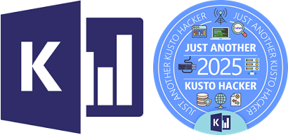

    <h1>Welcome to the <i>Just another Kusto hacker</i> ("JAKH") contest!
</h1>
    
    
<strong>Inspired by the <a href="https://wiki.c2.com/?JustAnotherPerlHacker"><i>Just another Perl hacker</i> ("JAPH")</a> challenge,  and <a href="https://www.ioccc.org/"><i>The International Obfuscated C Code Contest</i></a></strong>

---

In April 2025, the following challenge was presented:
- Write a Kusto query that outputs the string `"Just another Kusto hacker"`.
- The query can be as simple or as complex as authors like, as long as it is self-contained and can run on any Fabric EventHouse or Azure Data Explorer cluster.
- [Free Azure Data Explorer clusters](https://learn.microsoft.com/en-us/azure/data-explorer/start-for-free-web-ui) or the [Azure Data Explorer Emulator](https://learn.microsoft.com/en-us/azure/data-explorer/kusto-emulator-install) could be used for testing.

Participants were given the opportunity to vote on the most creative and innovative queries across multiple [categories](#categories).

[Sample queries](./resources/sample-queries) and [this blog post](https://y0nil.github.io/kusto.blog/blog-posts/jakh.html) were provided to help participants get inspired.

For full details of the contest, see [official rules](./CONTEST_RULES.md).

## Important dates

| Period | Starts                       | Ends                          | Status    |
|--------|------------------------------|-------------------------------|-----------|
| Entry  | April 1, 2025, 12:00 p.m. PT | April 30, 2025, 11:59 p.m. PT | Completed |
| Voting | May 1, 2025, 12:00 p.m. PT   | May 8, 2025, 12:00 p.m. PT    | Completed |

## Queries

***177 Kusto hackers submitted 202 queries! 🚀***

89 queries qualified to the voting stage - The participating queries can be found [here](./resources/participating-queries).

Queries that didn't meet the following criteria were excluded:

1. Had an invalid link to a GitHub gist.
2. Were semantically or syntactically invalid.
3. Were not self-contained, and relied on an external data source or a custom tool.
4. Did not output the requested string (`"Just another Kusto hacker"`) in any way, shape, or form.
5. Produced an inconsistent output when run sequentially.
6. Were too trivial. E.g.,:
  - `print "Just another Kusto hacker"`
  - `print base64_decode_tostring(base64_encode_tostring("Just another Kusto hacker"))`
  - `print strcat("Just another", "Kusto hacker")`

## Categories

Participating queries competed for votes in the following categories:

1. 🎭 **Most creative**: A query that showcases the most unique or unexpected approach to solving the problem in an obfuscated way. Creativity might involve innovative uses of query structures that are rarely used in typical queries.

2. 🤵 **Most elegant obfuscation**: A query that demonstrates elegance in its obfuscation, meaning that while the query is difficult to read, it does so in a sophisticated, intentional manner. Sometimes, simplicity (in terms of length or structure) can be elegant even if the query is complex to understand.

3. 😆 **Best humor**: A query that makes people laugh while still being functional and obfuscated might win this category. This could include humorous variable names, messages embedded in the query, or absurd logic that results in unexpected, amusing behavior.

4. 🤹‍♂️ **Best use of language features**: A query that utilizes unusual or advanced features of KQL to create the most obscure or unique result.

5. 🤏 **Best minimalism**: A query that achieves maximum obfuscation with the least amount of code might win in this category.

6. 😍 **People's choice**: The query that was liked the most. No special criteria, just the voters' personal preference.

## 🏆 And the winners are...
  
  | | Category                         | Author                                             | Query                                                     |
  |-|----------------------------------|----------------------------------------------------|-----------------------------------------------------------|
  |1| 🏅 Most creative                 | [@LachyDeeW](https://github.com/LachyDeeW)         | [query-88](./resources/participating-queries/query-88.md) |
  |2| 🏅 Most elegant obfuscation (a)  | [@NeilMacMullen](https://github.com/NeilMacMullen) | [query-58](./resources/participating-queries/query-58.md) |
  |2| 🏅 Most elegant obfuscation (b)  | [@KustoKing](https://github.com/KustoKing)         | [query-61](./resources/participating-queries/query-61.md) |
  |3| 🏅 Best humor                    | [@LachyDeeW](https://github.com/LachyDeeW)         | [query-88](./resources/participating-queries/query-88.md) |
  |4| 🏅 Best use of language features | [@myevo8u](https://github.com/myevo8u)             | [query-83](./resources/participating-queries/query-83.md) |
  |5| 🏅 Best minimalism               | [@razi-rais](https://github.com/razi-rais)         | [query-01](./resources/participating-queries/query-01.md) |
  |6| 🏅 People's choice               | [@LachyDeeW](https://github.com/LachyDeeW)         | [query-88](./resources/participating-queries/query-88.md) |

## Coming soon: **Kusto Detective Agency - Call of the cyber duty**

The 3rd season of the **Kusto Detective Agency** is coming soon. Register now and spread the word!

- 💰 **Total prize amount of $21,000, and $10,000 for the 1st place**
- 📅 **Save the date**: June 8th, 2025
- 📝 **[Register now](http://detective.kusto.io/register)**
- 📜 **[Competition rules](https://detective.kusto.io/CyberDutyRules)**
- 📺 **[Watch the trailer](https://www.youtube.com/watch?v=sPmTvXOZrnE)**

  

---

## Contributing

This project welcomes contributions and suggestions.  Most contributions require you to agree to a
Contributor License Agreement (CLA) declaring that you have the right to, and actually do, grant us
the rights to use your contribution. For details, visit https://cla.opensource.microsoft.com.

When you submit a pull request, a CLA bot will automatically determine whether you need to provide
a CLA and decorate the PR appropriately (e.g., status check, comment). Simply follow the instructions
provided by the bot. You will only need to do this once across all repos using our CLA.

This project has adopted the [Microsoft Open Source Code of Conduct](https://opensource.microsoft.com/codeofconduct/).
For more information see the [Code of Conduct FAQ](https://opensource.microsoft.com/codeofconduct/faq/) or
contact [opencode@microsoft.com](mailto:opencode@microsoft.com) with any additional questions or comments.

## Trademarks

This project may contain trademarks or logos for projects, products, or services. Authorized use of Microsoft 
trademarks or logos is subject to and must follow 
[Microsoft's Trademark & Brand Guidelines](https://www.microsoft.com/en-us/legal/intellectualproperty/trademarks/usage/general).
Use of Microsoft trademarks or logos in modified versions of this project must not cause confusion or imply Microsoft sponsorship.
Any use of third-party trademarks or logos are subject to those third-party's policies.
